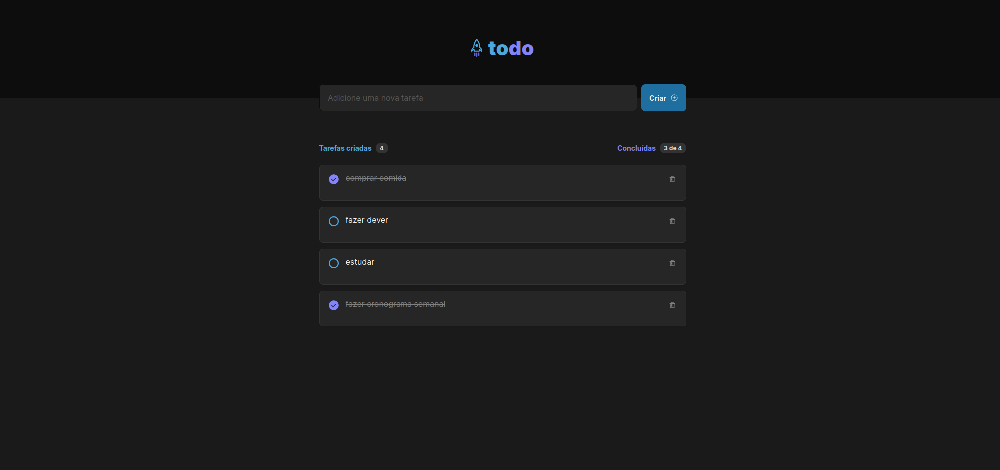

  

<h1 align="center">
  Todo Ignite
</h1>

  
  

 

> Aplicação React de um simples todo list

## Screenshot

## 🚀 Como rodar o projeto

### 🛹 Clone o repositório

`git clone https://github.com/andreseichi/todo-ignite.git`

ou

`git@github.com:andreseichi/todo-ignite.git`

### 📒 Acesse o repositório local

`cd todo-ignite`

### 🧭 Instale todas as dependências

`yarn`

### 🏃‍♂️ Rode o projeto

`yarn dev`

### 🔨 Build

`yarn build`

## [Demo](https://todo-ignite-psi.vercel.app/)
